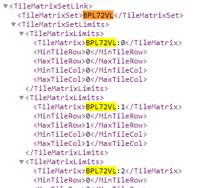

# wmts-kvp-to-restful

## Purpose

WMTS-KVP-to-RESTful is a WMTS RESTful proxy that rewrites WMTS KVP request to WMTS RESTful request.

Template used: org-path/{layer}/{tilematrixset}/{tilematrix}/{tilecol}/{tilerow}.{translated format}

## Example

```http
/tiles/service/wmts?layer=brtachtergrondkaart&style=default&tilematrixset=EPSG:28992&Service=WMTS&Request=GetTile&Version=1.0.0&Format=image/png&TileMatrix=04&TileCol=7&TileRow=8
```

becomes

```http
/tiles/service/wmts/brtachtergrondkaart/EPSG:28992/04/7/8.png
```

## Geowebcache issue

The WMTS-KVP-to-RESTful proxy will try to solve the issue with Geowebcache WMTS KVP generated requests. The issue is that the tilematrix values generated contain the tilematrixset as a prefix. This something that doesn't match well with a WMTS RESTful request. This is a issue that some are [experiencing](https://geoforum.nl/t/wmts-tilematrix-parameter-maakt-request-ongelding/2928) and that we ourself have experienced, especially when are service is migrated from Geowebcache to a new WMTS server (like mapproxy).

A invalid WMTS RESTful path would be generate, the WMTS KVP request:

```http
/ws/raadpleegdiensten/wmts?SERVICE=WMTS&REQUEST=GetTile&VERSION=1.0.0&LAYER=grb_bsk_grijs&STYLE=&TILEMATRIXSET=BPL72VL&TILEMATRIX=BPL72VL:11&TILEROW=1072&TILECOL=730&FORMAT=image/png
```

becomes

```http
/ws/raadpleegdiensten/wmts/grb_bsk_grijs/BPL72VL/BPL72VL:11/730/1072.png
```

with a incorrect tilematrix value of BPL72VL:11 instead of 11. Through a regex the prefix will we stripped from the tilematrix value.



## Tech

### test

```go
go test
```

### run

```go
go run wmts-kvp-to-restful.go -host=https://geodata.nationaalgeoregister.nl
```

### build

```go
go build wmts-kvp-to-restful.go
```

## docker

```docker
docker build -t pdok/wmts-kvp-to-restful .
docker run --name wmts-ktr -d -p 9001:9001 pdok/wmts-kvp-to-restful /wmts-kvp-to-restful -host=https://geodata.nationaalgeoregister.nl
docker stop wmts-ktr && docker rm wmts-ktr
```
